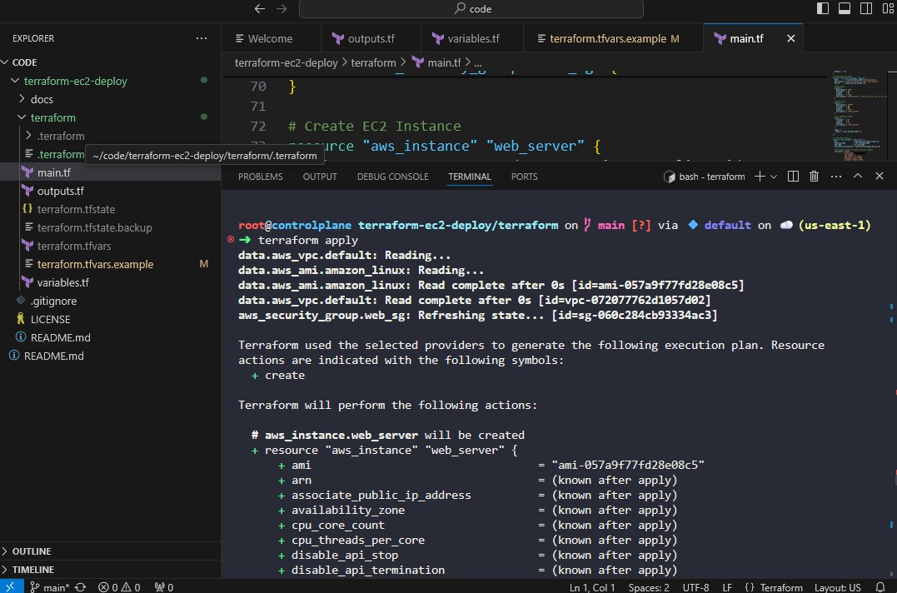
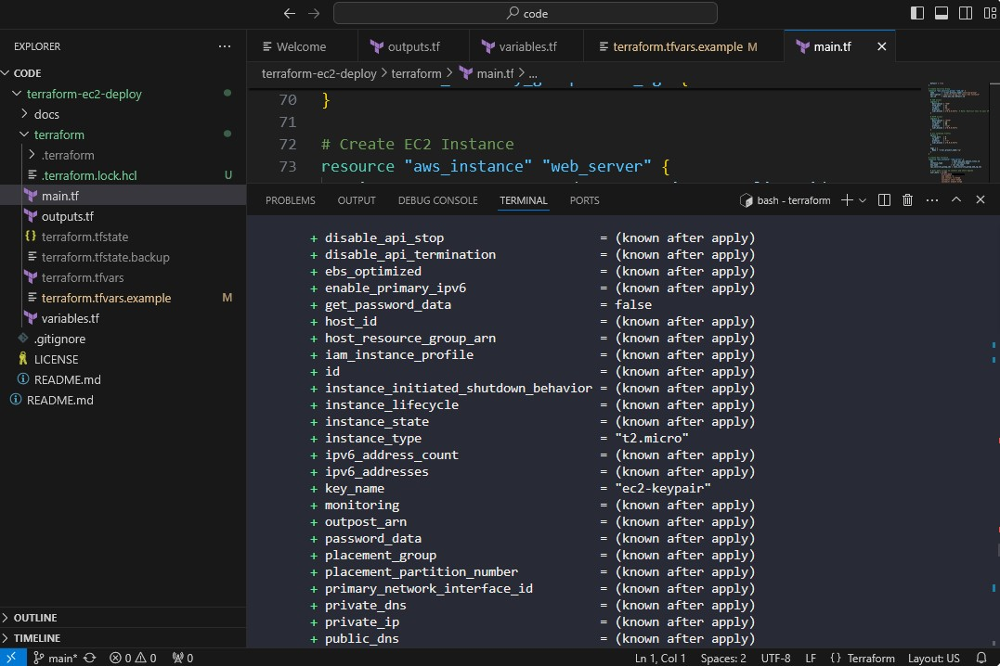
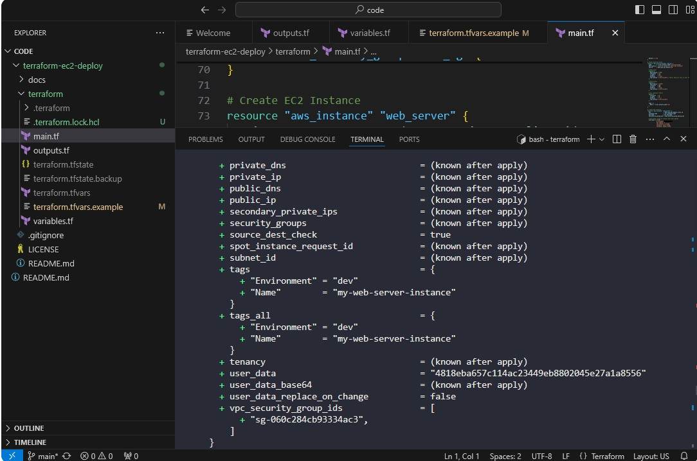
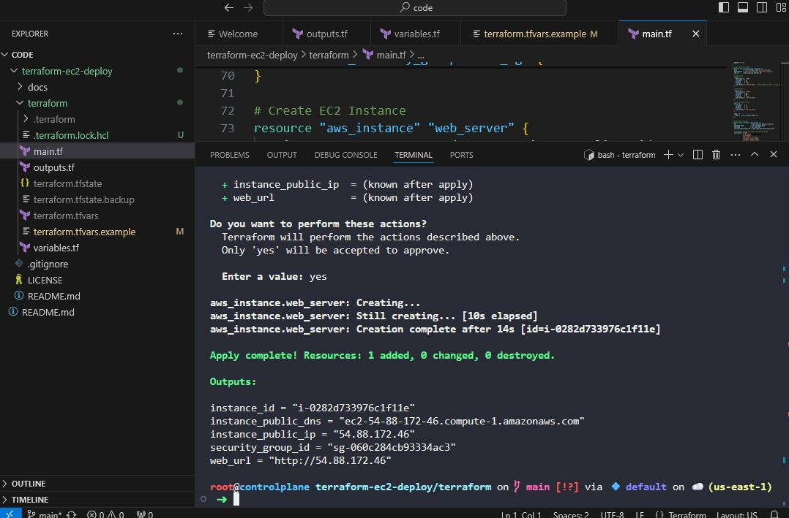
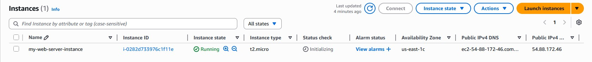
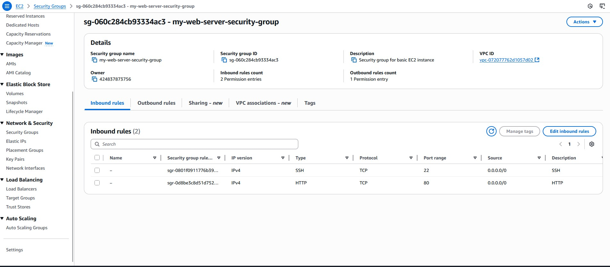

# Project Name - EC2 Terraform Deployment

## Overview
Brief description of what this deployment does

## Architecture
Link to detailed architecture documentation

## Quick Start
- Prerequisites
- Installation steps
- Basic usage

## Documentation
- [Deployment Guide](./docs/deployment-guide.md)
- [Architecture Overview](./docs/architecture.md)
- [Troubleshooting](./docs/troubleshooting.md)

## 📸 Deployment Screenshots

### 1. Terraform Apply

### 2. EC2 Instance

### 3. Security Group

